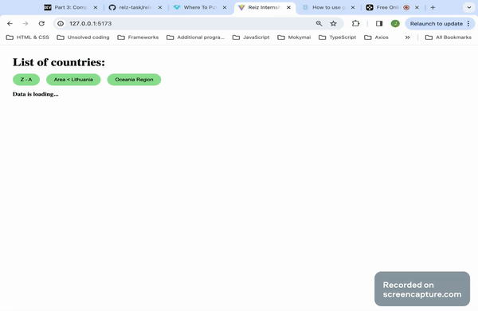

# Reiz internship task by Joana Mastianica

## About Task

This project was undertaken to apply for the Reiz Frontend Developer internship. The main objective was to develop application that executes these functionalities:

* Fetch data from API (https://restcountries.com).
* Display a list of data.
* List is sortable alphabetically by name (ascending, descending).
* Filters countries:
  * That are smaller than Lithuania by area.
  * That are in “Oceania” region.
<br><br>

## Application example

<br>



<br>

## Technologies Used 

<br>

### Front-end

* Vite for work environment configuration
* Typescript 
* React framework
* SCSS for styling
* Eslint for code problems active spotting

### API 

* Source: https://restcountries.com
* Endpoint to fetch data: https://restcountries.com/v2/all?fields=name,region,area

NOTE: please be patient, as data takes some time to load. Refresh page if you'll not get a response for more than 30 seconds.


<br>

## To Run Application 
<br>


1. Save the project to your local environment from my [github repository.](https://github.com/JoanaMas/reiz-task)


2. Open project using code editor (example: Visual Studio Code), and navigate to the [src](./src) folder. With the right mouse click open the integrated terminal. Run command to launch project<br><br>

```
npm run dev
```

# View code:

You can view the code of the application in the [Online GitHub Editor](https://github.com/JoanaMas/reiz-task/tree/master/reiz-task-internship).